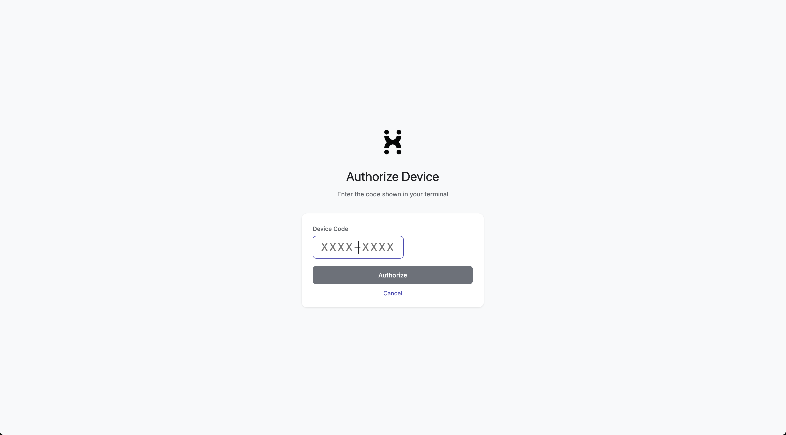

# hpphub

HPP Hub CLI — connect AI tools to [HPP Hub](https://hub.hpp.io) with a single command.

```bash
hpphub launch openclaw      # OpenClaw (AI assistant)
hpphub launch claude        # Claude Code (coding agent)
```

## Install

**macOS / Linux:**
```bash
curl -fsSL https://raw.githubusercontent.com/hpp-io/hpphub-cli/main/install.sh | sudo bash
```

**Windows (PowerShell):**
```powershell
irm https://raw.githubusercontent.com/hpp-io/hpphub-cli/main/install.ps1 | iex
```

> If you see an Execution Policy error, run `Set-ExecutionPolicy -Scope CurrentUser RemoteSigned` first.
> After installation, restart the terminal for PATH to take effect.

**Windows (WSL2) — Recommended:**
```bash
curl -fsSL https://raw.githubusercontent.com/hpp-io/hpphub-cli/main/install.sh | sudo bash
```

**Build from source (Go 1.24+):**
```bash
git clone https://github.com/hpp-io/hpphub-cli.git && cd hpphub-cli
go build -o hpphub ./cmd/hpphub/
```

## Quick Start

### OpenClaw — AI assistant on your messaging apps

```bash
hpphub launch openclaw
```

### Claude Code — AI coding agent in your terminal

```bash
hpphub launch claude
```

To use `claude` directly without `hpphub` every time:

```bash
hpphub launch claude --persist    # saves HPP settings to your shell profile
# restart terminal, then just run:
claude

hpphub launch claude --unpersist  # removes HPP settings from shell profile
```

Both commands handle everything automatically — install, login, configure, and start. Already logged in? It skips straight to setup.

See [How It Works](#how-it-works) for the full flow.

## Commands

| Command | Description |
|---------|-------------|
| `hpphub launch openclaw` | Install + login + configure + start OpenClaw with HPP |
| `hpphub launch openclaw --model <m>` | Same as above, with a specific model (skip selection prompt) |
| `hpphub launch openclaw --config` | Update OpenClaw settings only (useful for changing model without restarting) |
| `hpphub launch claude` | Install + login + launch Claude Code with HPP |
| `hpphub launch claude --persist` | Save HPP settings to shell profile (run `claude` directly after) |
| `hpphub launch claude --unpersist` | Remove HPP settings from shell profile |
| `hpphub login` | Log in to HPP Hub |
| `hpphub logout` | Log out |
| `hpphub whoami` | Show current login status |
| `hpphub models` | List available models with pricing |
| `hpphub setup telegram` | Connect a Telegram bot to OpenClaw |
| `hpphub uninstall` | Remove hpphub and its configuration |

## How It Works

### OpenClaw — AI assistant on your messaging apps

```bash
$ hpphub launch openclaw

Checking OpenClaw installation...
  ✓ OpenClaw detected                     # auto-installs if missing

Not logged in. Starting login flow...
  Your code: ABCD-1234                     # enter this code in the browser
  Browser opened. Enter the code and authorize.
```



```
  ✓ Logged in as you@example.com
  ✓ API key saved

  Available models:
   1. anthropic/claude-sonnet-4-6          ($3.00/$15.00 per M tokens)
   2. openai/gpt-5-mini                    ($0.25/$2.00 per M tokens)
  Select model (number): 2                 # pick a model

  ✓ HPP provider configured in OpenClaw

  Set up Telegram bot? (Y/n): Y            # optional — connect Telegram
  Paste your Telegram bot token: ...
  ✓ Bot token saved

  ✓ OpenClaw gateway running               # ready to use
```

Now send a message to your bot on Telegram, WhatsApp, or Slack — it responds using your chosen HPP model.

Re-running `hpphub launch openclaw` when already configured skips setup and starts the gateway directly:

```bash
$ hpphub launch openclaw

  ✓ OpenClaw detected
  ✓ Logged in as you@example.com
  ✓ HPP already configured (model: hpp/openai/gpt-5-mini)
  ✓ Gateway already running
```

To change model, use `--model`:
```bash
hpphub launch openclaw --model anthropic/claude-sonnet-4-6
```

### Claude Code — AI coding agent in your terminal

First time (not logged in yet):

```bash
$ hpphub launch claude

Checking Claude Code installation...
  ✓ Claude Code detected                  # auto-installs if missing

Not logged in. Starting login flow...
  Your code: WXYZ-5678                     # same Device Code Flow as OpenClaw
  Browser opened. Enter the code and authorize.
  ✓ Logged in as you@example.com
  ✓ API key saved
  ✓ Model: claude-sonnet-4-6

  Starting Claude Code with HPP...

$ claude >                                 # Claude Code prompt, powered by HPP
```

Already logged in (via any previous `hpphub` command):

```bash
$ hpphub launch claude

Checking Claude Code installation...
  ✓ Claude Code detected
  ✓ Logged in as you@example.com           # login skipped
  ✓ Model: claude-sonnet-4-6

  Starting Claude Code with HPP...

$ claude >
```

## OpenClaw — Telegram Setup

Telegram setup is offered during `hpphub launch openclaw`. You can also run it separately:

```bash
$ hpphub setup telegram

  To create a Telegram bot:

  1. Open Telegram and talk to @BotFather
  2. Send /newbot and follow the steps
  3. Copy the bot token

  Paste your Telegram bot token: 123456789:ABCdefGHI...
  ✓ Bot token saved

  Your Telegram user ID (or press Enter to skip): 123456789
  ✓ Access restricted to your account

  ✓ Gateway restarted
  ✓ Telegram bot connected!
```

Other channels (WhatsApp, Discord, Slack, etc.):
```bash
openclaw configure --section channels
```

## Configuration

**CLI config** — `~/.hpphub/config.json`:
```json
{
  "api_key": "hpph_...",
  "base_url": "https://router.hpp.io/llm/v1",
  "email": "user@example.com"
}
```

**OpenClaw config** — `~/.openclaw/openclaw.json` (auto-generated by `hpphub launch openclaw`)

## Windows Notes

- **Gateway**: Runs in foreground on Windows native. Keep the terminal open for Telegram/WhatsApp. WSL2 supports background mode.
- **Execution Policy**: May need `Set-ExecutionPolicy -Scope CurrentUser RemoteSigned` before install.
- **Terminal restart**: Required after install for PATH to take effect.

## License

MIT
